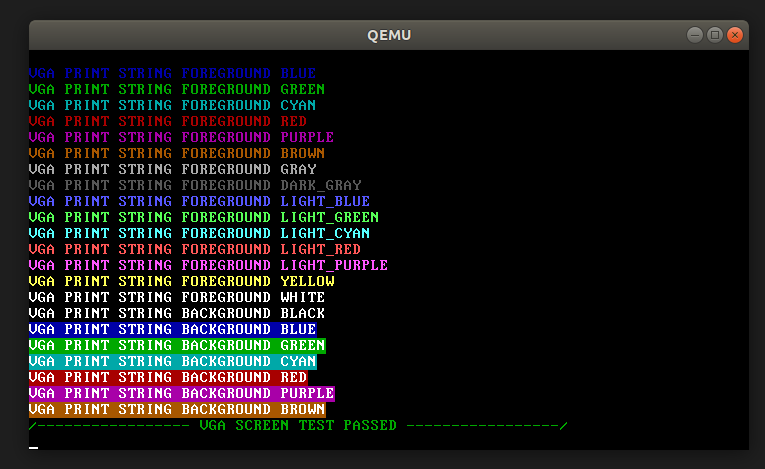

# A simple Bootloader and x86 Kernel

# Install:
    - First install Bochs Emulator: http://bochs.sourceforge.net/getcurrent.html
    - Run commands:
        * cd OS
        * mkdir bin
        * make all
        * make run
    - At the bochs terminal prompt type c for continue executing
    - Press enter and choose 'kernel'

# VGA Screen Shot:
